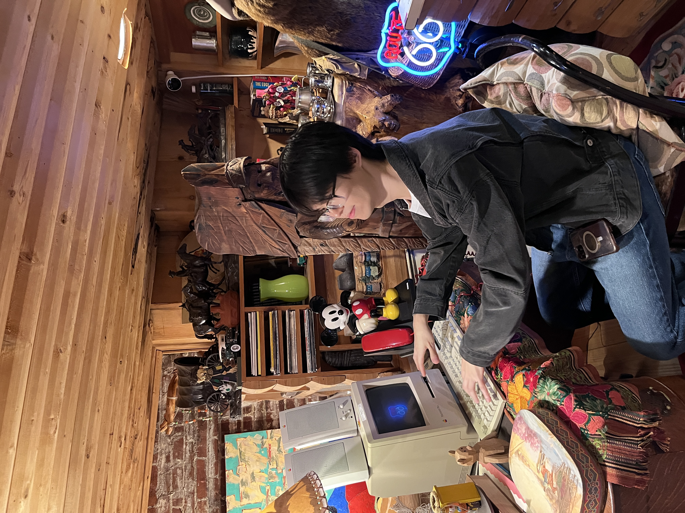

<link rel="stylesheet" href="css/style.css">

  
  

    <h1>I Lang Jung</h1>
    

      Washington, D.C. ·
      <a href="mailto:ian@example.com">ijung1214@gmail.com</a> ·
      <a href="https://www.linkedin.com/in/yourlinkedin">LinkedIn</a>
    

  

## Education

**University of Virginia** — Charlottesville, VA  
**B.A. in Computer Science**  
*May 2022*

## Work Experience & Relevant Projects

### Pariveda — Technical Consultant  
*June 2022 – Present*
- Led a five-member DevOps team maintaining and building new features for an education services client, with a focus on standardizing best practices.
- Served as security lead; organized sprint planning and grooming, and managed communication between the development team and clients.
- Worked as a full-stack engineer with emphasis on **Java Spring**, **Oracle SQL**, **AWS CDK**, **Serverless**, and **RESTful APIs**.
- Managed production deployments, handled critical incident response, and maintained disaster recovery practices.

### UVA Development Hub — Developer  
*April 2021 – July 2021*
- Collaborated on a full-stack web application that filters and analyzes salary survey data from AskAManager.org (2019–2021), comprising over 30,000 responses.
- Built the frontend using **React** and **Material UI**, implemented a **MongoDB** backend, and developed a **Node.js** API to connect the database and frontend.
- Gained experience in data cleaning with **Python**, use of the **Google Maps JavaScript API**, and **SQL**.

### Virginia Transportation Research Council — Research Intern  
*September 2018 – May 2019*
- Studied traffic models and GIS technology to predict roadway noise levels for the Split Pairs Project in Lynchburg, Virginia.
- Analyzed field-collected data using Excel and contributed to ongoing research on the impact of traffic noise on surrounding neighborhoods.

## Skills & Certification

- **Technologies:** AWS, Java, TypeScript, Python, Oracle SQL, Spring Boot, Serverless, AWS CDK, React
- **Certification:** AWS Certified Solutions Architect – Associate
- **Languages:** Fluent in Korean; conversational in Chinese

